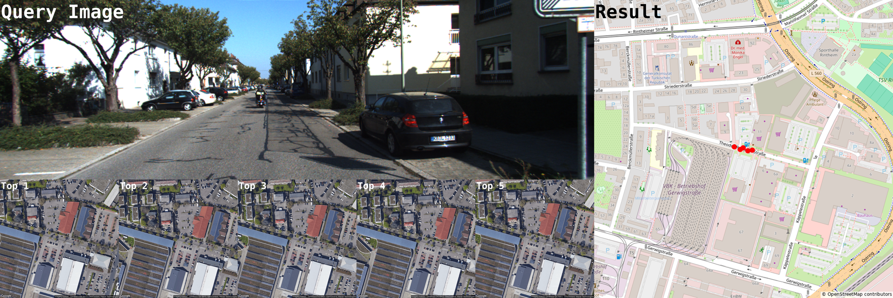

# CIPER :round_pushpin:

**C**ross-view **I**mage-retrieval and **P**ose-estimation transform**ER** 

## Environment

### Step 1: Requirements
* CUDA 11.6
* cuDNN 8
* Ubuntu 20.04

### Step 2: Create environment

Option 1: Anaconda
```
conda create -n ciper python=3.8
conda activate ciper
pip install -r requirements.txt
```

Option 2: Docker
```
docker build -f .devcontainer/ciper.Dockerfile -t ciper:1.0 .
docker run -it --gpus all -e HOST_USER_ID=$(id -u) -e HOST_USER_GID=$(id -g) --shm-size 8G --name xiver -v /home/$(whoami):/home/$(whoami) -v /data:/data ciper:1.0 /bin/bash
```

## Data

### VIGOR

Download [VIGOR](https://github.com/Jeff-Zilence/VIGOR). The folder structure is as follows:
```
vigor
├── Chicago
|   ├── panorama
|   └── satellite
├── NewYork
├── ..
└── splits__corrected
    ├── Chicago
    |   ├── pano_label_balanced__corrected.txt
    |   └── ..
    └── ..

```

### KITTI

Download KITTI [ground images](https://www.cvlibs.net/datasets/kitti/raw_data.php) and [satellite images](https://github.com/shiyujiao/HighlyAccurate). The folder structure is as follows:
```
kitti
├── raw
|   ├── 2011_09_26
|   |   ├── 2011_09_26_drive_0001_sync
|   |   |   ├── image_00
|   |   |   ├── image_01
|   |   |   ├── image_02
|   |   |   ├── image_03
|   |   |   └── oxts    
|   |   ├── 2011_09_26_drive_0002_sync    
|   |   └── ..
|   ├── 2011_09_28
|   └── ..
└── satellite
    ├── 2011_09_26
    |   ├── 2011_09_26_drive_0001_sync
    |   ├── 2011_09_26_drive_0002_sync
    |   └── ..
    ├── 2011_09_28
    └── ..

```

### Ford multi-AV

Download Ford [ground images](https://avdata.ford.com/downloads/default.aspx) and [satellite images](https://github.com/shiyujiao/HighlyAccurate). The folder structure is as follows:
```
ford
├── 2017-08-04
|   └── V2
|       ├── Log1
|       |   ├── 2017-08-04-V2-Log1-FL
|       |   ├── SatelliteMaps_18
|       |   └── grd_sat_quaternion_latlon.txt   
|       ├── Log2   
|       └── ..
├── 2017-10-26
|   └── V2
|       ├── Log1
|       └── ..
└── Calibration-V2
    └── V2
        ├── cameraFrontLeft_body.yaml
        └── ..
```

## Train & Eval

### Train 
Set configuration in `configs/train/**.yaml` file and run:
```
python main.py --config configs/train/**.yaml
```

### Evaluate
Set configuration in `configs/test/**.yaml` file and run:
```
python main.py --config configs/test/**.yaml
```

## Demo

Set configuration in `configs/demo/**.yaml` file and run:
```
python demo.py --config configs/demo/**.yaml 
```
Samples for demo are located in `./demo/kitti` and `./demo/vigor`

### Result


## Pretrained model

* [VIGOR](https://drive.google.com/drive/folders/13iOB-K30lCy8BeOe92eByKlveZ3kPMUn?usp=sharing)
* [KITTI](https://drive.google.com/drive/folders/1ohE0jSxAgq6NxBu4F1dQZIP5sFE9y63q?usp=sharing)
* [Ford](https://drive.google.com/drive/folders/10wb2SXch5IfXhtpMgCpQ8DRChRGlysJW?usp=sharing)


## Acknowledgements
This project is not possible without the following awesome open-source codebases:
* [TransGeo: Transformer Is All You Need for Cross-view Image Geo-localization](https://github.com/Jeff-Zilence/TransGeo2022)
* [Beyond Cross-view Image Retrieval: Highly Accurate Vehicle Localization Using Satellite Image](https://github.com/shiyujiao/HighlyAccurate)
* [DETR: End-to-End Object Detection with Transformers](https://github.com/facebookresearch/detr)
* [segment-anything](https://github.com/facebookresearch/segment-anything)
